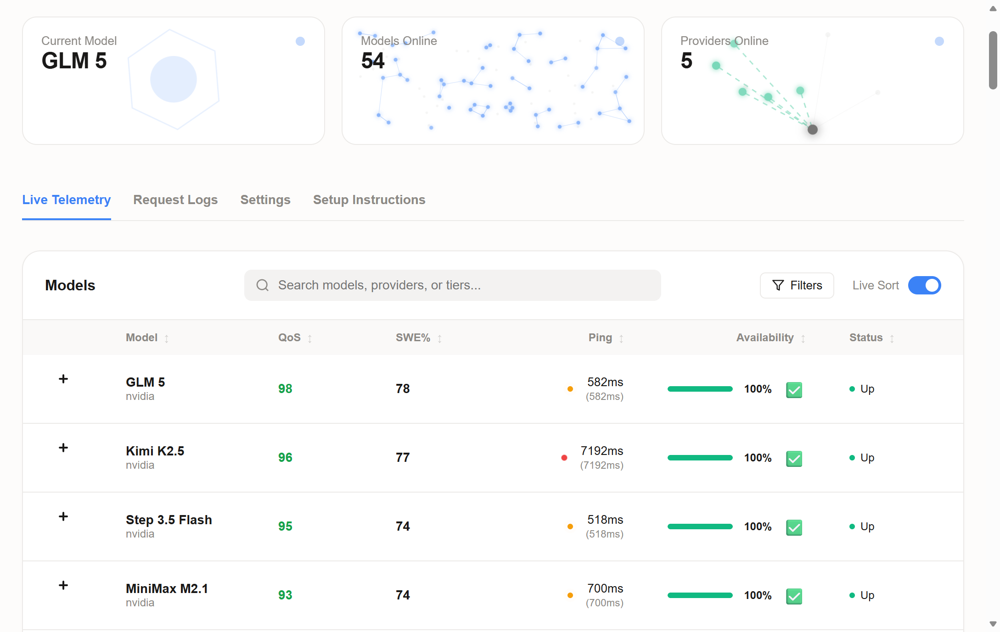

# 🚀 modelrelay

[](https://npmjs.com/package/modelrelay)
[](https://github.com/ellipticmarketing/modelrelay/stargazers)
[](https://discord.gg/FxseNnd5)

[**Join our Discord**](https://discord.gg/FxseNnd5) for discussions, feature requests, and community support.

<div align="center">
  
  <br/>
  <p><i>The smartest, fastest, and completely free local router for your AI coding needs.</i></p>
</div>

---

### 🔥 100% Free • Auto-Routing • 80+ Models • 10+ Providers • OpenAI-Compatible

**modelrelay** is an OpenAI-compatible local router that benchmarks free coding models across top providers and automatically forwards your requests to the best available model. 

### ✨ Why use modelrelay?

- 💸 **Completely Free:** Stop paying for API usage. We seamlessly provide access to robust free models.
- 🧠 **State-of-the-Art (SOTA) Models:** Out-of-the-box availability for top-tier models including **Kimi K2.5, Minimax M2.5, GLM 5, Deepseek V3.2**, and more.
- 🏢 **Reliable Providers:** We route requests securely through trusted, high-performance platforms like **NVIDIA, Groq, OpenRouter, and Google**.
- ⚡ **Lightning Fast:** The built-in benchmark continually evaluates metrics to pick the fastest and most capable LLM for your request.
- 🔄 **OpenAI-Compatible:** A perfect drop-in replacement that works seamlessly with your existing tools, scripts, and workflows.

## 🚀 Install

```bash
npm install -g modelrelay
```

## ⚡ Quick Start

```bash
# 1) Onboard: save provider API keys and optionally auto-configure integrations
modelrelay onboard

# 2) Start the local router (default port 7352)
modelrelay
```

Router endpoint:

- Base URL: `http://127.0.0.1:7352/v1`
- API key: any string
- Model: `auto-fastest` (router picks actual backend)

## OpenCode Quick Start

`modelrelay onboard` can auto-configure OpenCode.

If you want manual setup, put this in `~/.config/opencode/opencode.json`:

```json
{
  "$schema": "https://opencode.ai/config.json",
  "provider": {
    "router": {
      "npm": "@ai-sdk/openai-compatible",
      "name": "modelrelay",
      "options": {
        "baseURL": "http://127.0.0.1:7352/v1",
        "apiKey": "dummy-key"
      },
      "models": {
        "auto-fastest": {
          "name": "Auto Fastest"
        }
      }
    }
  },
  "model": "router/auto-fastest"
}
```

## OpenClaw Quick Start

`modelrelay onboard` can auto-configure OpenClaw.

If you want manual setup, merge this into `~/.openclaw/openclaw.json`:

```json
{
  "models": {
    "providers": {
      "modelrelay": {
        "baseUrl": "http://127.0.0.1:7352/v1",
        "api": "openai-completions",
        "apiKey": "no-key",
        "models": [
          { "id": "auto-fastest", "name": "Auto Fastest" }
        ]
      }
    }
  },
  "agents": {
    "defaults": {
      "model": {
        "primary": "modelrelay/auto-fastest"
      },
      "models": {
        "modelrelay/auto-fastest": {}
      }
    }
  }
}
```

## CLI

```bash
modelrelay [--port <number>] [--log] [--ban <model1,model2>]
modelrelay onboard [--port <number>]
modelrelay install --autostart
modelrelay start --autostart
modelrelay uninstall --autostart
modelrelay status --autostart
modelrelay update
modelrelay autoupdate [--enable|--disable|--status] [--interval <hours>]
modelrelay autostart [--install|--start|--uninstall|--status]
```

Request terminal logging is disabled by default. Use `--log` to enable it.

`modelrelay install --autostart` also triggers an immediate start attempt so you do not need a separate command after install.

During `modelrelay onboard`, you will also be prompted to enable auto-start on login.

`modelrelay update` upgrades the global npm package and, when autostart is configured, stops the background service first and starts it again after the update.

Auto-update is enabled by default. While the router is running, modelrelay checks npm periodically (default: every 24 hours) and applies updates automatically.

Use `modelrelay autoupdate --status` to inspect state, `modelrelay autoupdate --disable` to turn it off, and `modelrelay autoupdate --enable --interval 12` to re-enable with a custom interval.

## Config

- Router config file: `~/.modelrelay.json`
- API key env overrides:
  - `NVIDIA_API_KEY`
  - `GROQ_API_KEY`
  - `CEREBRAS_API_KEY`
  - `SAMBANOVA_API_KEY`
  - `OPENROUTER_API_KEY`
  - `CODESTRAL_API_KEY`
  - `HYPERBOLIC_API_KEY`
  - `SCALEWAY_API_KEY`
  - `QWEN_CODE_API_KEY` (or `DASHSCOPE_API_KEY`)
  - `GOOGLE_API_KEY`

For `Qwen Code`, modelrelay supports both API keys and Qwen OAuth cached credentials (`~/.qwen/oauth_creds.json`).
If OAuth credentials exist, modelrelay will use them and refresh access tokens automatically.
You can also start OAuth directly from the Web UI Providers tab using `Login with Qwen Code`.

---

⭐️ If you find modelrelay useful, please consider [starring the repo](https://github.com/ellipticmarketing/modelrelay)!
